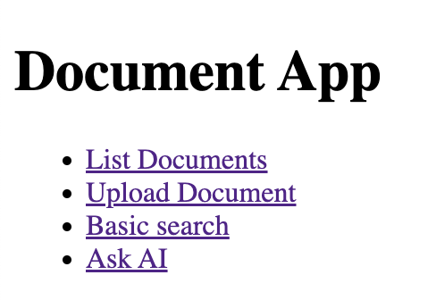

# gently-challenge

This project includes a Node.js backend and a simple HTML UI for document upload, search, and AI-powered question answering.

## 🏃 Getting Started

To run the code locally:

```bash
cd gently-challenge
echo ANTHROPIC_API_KEY=sk-ant-***** >> .env
node index.js
```
Open http://localhost:3000 in your browser.




## Features

List documents: this page allows you to see all documents available in the system (few documents are preloaded).
Upload documents: this page allows you to select a document from your drive and upload it to the system.
Basic search: search documents by exact test.
Ask AI: talk to Claude about the documents.

## Project structure

gently-challenge/
├── data/           # Uploaded documents are stored here
├── db/             # Mocking a database with an in-memory JS object
├── node_modules/   # All required modules
├── public/         # HTML pages (static endpoints)
├── routes/         # Processes that users can interact with
├── services/       # Internal logic and integrations (Claude, parsing, etc.)
├── index.js        # Main project entry point
├── .env            # Environment variables (not committed)


More details about each file available within the files.